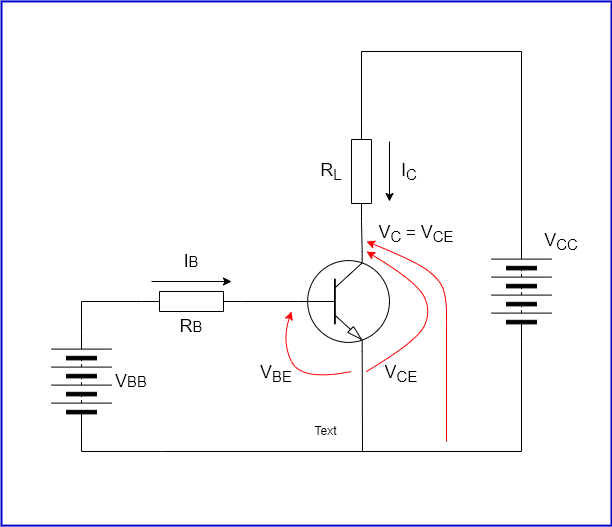

## BJT transistors:

Symbols refer to: 

IB is the base current
IE is the emitter current
IC is the collector current

IE = IC + IB

VCE is the voltage between the Collector and the Emitter (generally a positive value for NPN transistors)
VBE is the voltage between the Base and the Emitter(generally positive for NPN’s)

β is the DC current gain (β is given in the datasheet of a given transistor as hFE)

IC = βIB

two modes: Cutoff and Saturation

IC = βIB. if IB = 0 then IC = 0. This is called cut-off mode. (in this case, VC is the same as VCC)

IC reaches the maximum value when VC = 0 (the transistor is a dead short to ground). This is called saturation mode.

cut-off and saturation are the two states where the transistor will be dissipating the lowest power

Saturation:

IC = βIB only holds until the transistor is saturated.
When a transistor is saturated VCE will be at a value of VCEsat (VCEsat given in the transistor datasheet)
In order to saturate the transistor, the minimum IB required is the value that will cause the maximum IC, given the β value of the transistor and the circuit conditions. (with 10% to 15% margin)

Power dissipated = IC x VCEsat

IB = (VBB – VBE) / RB (Ohm’s Law)
RB = (VBB – VBE) / IB

When used with a microcontroller:
Knowing its logic high value, the required load current and the transistor β value, the value of RB can easily be calculated.

Make sure IB does not exceed the drive current capability of the microcontroller.

Make sure load current does not exceed the maximum collector current of the transistor.

Make sure power dissipation in saturation mode does not exceed the maximum power dissipation of the transistor.

Make sure VCC voltage does not exceed the maximum VCE of the transistor.

Reccomended 20% margins

## Our setup:
Transistor
h_FE = 1000 = β
IC = 5A
max IB = 120mA
VCBO = 60V
VBE = 2.5V @VCE = 3V, IC = 3A
VCEsat =    2V @IC = 3A, IB = 12mA
            4V @IC = 5A, IB = 20mA
VCEO = 60V @IC = 100mA, IB = 0
Pc = 65W

Microcontroller
VBB = 3.3V
IB = 16mA

Motor
VCC = 14V
IC = 5A

Calculated

RB = (VBB – VBE) / IB
IB 15% = 16mA \* (1 - 0.15) = 13.6mA
RB = (3.3V – 2.5V) / 13.6mA = 0.8V / 0.0136A
RB = 58.8Ω

IC = βIB
IC = 1000 * 13.6mA = 13600mA = 13.6A
IC = 13.6A

Power dissipated = IC x VCEsat
Pd = 13.6A * 10.88V
Pd = 147.9W
Pc = 65W
Pd > Pc **!! BAD**

